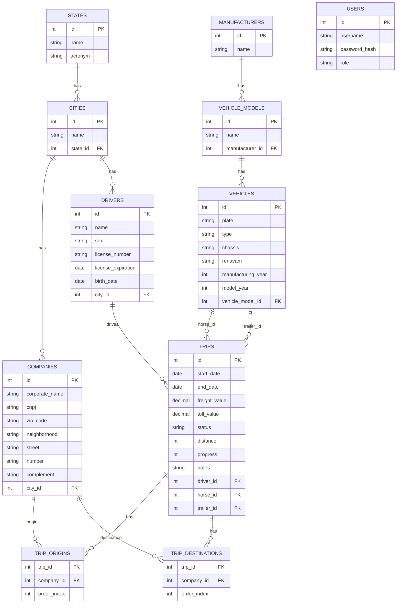

# Modelo Relacional PAVI

## Base usada

Este modelo foi reconstruido a partir do frontend Angular e do contrato atual da API, porque o backend local em `127.0.0.1:8080` nao estava acessivel no momento da analise.

As principais evidencias estao em:

- [src/app/core/models/models.ts](/C:/Users/pietr/OneDrive/Área%20de%20Trabalho/pavi/pavi/src/app/core/models/models.ts)
- [src/app/core/services/api.service.ts](/C:/Users/pietr/OneDrive/Área%20de%20Trabalho/pavi/pavi/src/app/core/services/api.service.ts)
- [src/app/core/services/data.service.ts](/C:/Users/pietr/OneDrive/Área%20de%20Trabalho/pavi/pavi/src/app/core/services/data.service.ts)

## Entidades

### `states` (`estado`)

| Coluna | Tipo logico | Regra |
|---|---|---|
| `id` | PK | identificador |
| `name` | texto | obrigatorio |
| `acronym` | texto | sigla UF |

### `cities` (`cidade`)

| Coluna | Tipo logico | Regra |
|---|---|---|
| `id` | PK | identificador |
| `name` | texto | obrigatorio |
| `state_id` | FK | `states.id` |

### `manufacturers` (`fabricante`)

| Coluna | Tipo logico | Regra |
|---|---|---|
| `id` | PK | identificador |
| `name` | texto | obrigatorio |

### `vehicle_models` (`modelo`)

| Coluna | Tipo logico | Regra |
|---|---|---|
| `id` | PK | identificador |
| `name` | texto | obrigatorio |
| `manufacturer_id` | FK | `manufacturers.id` |

### `vehicles` (`veiculo`)

| Coluna | Tipo logico | Regra |
|---|---|---|
| `id` | PK | identificador |
| `plate` | texto | placa |
| `type` | texto | `TRACTOR` ou `TRAILER` |
| `chassis` | texto | chassi |
| `renavam` | texto | renavam |
| `manufacturing_year` | inteiro | ano fabricacao |
| `model_year` | inteiro | ano modelo |
| `vehicle_model_id` | FK | `vehicle_models.id` |

### `companies` (`empresa` / `embarcador`)

| Coluna | Tipo logico | Regra |
|---|---|---|
| `id` | PK | identificador |
| `corporate_name` | texto | razao social |
| `cnpj` | texto | CNPJ |
| `zip_code` | texto | CEP |
| `neighborhood` | texto | bairro |
| `street` | texto | rua |
| `number` | texto | numero |
| `complement` | texto | opcional |
| `city_id` | FK | `cities.id` |

### `drivers` (`motorista`)

| Coluna | Tipo logico | Regra |
|---|---|---|
| `id` | PK | identificador |
| `name` | texto | obrigatorio |
| `sex` | texto | `M` ou `F` |
| `license_number` | texto | CNH |
| `license_expiration` | data | validade da CNH |
| `birth_date` | data | data de nascimento |
| `city_id` | FK | `cities.id` |

### `users` (`usuario`)

| Coluna | Tipo logico | Regra |
|---|---|---|
| `id` | PK | identificador |
| `username` | texto | login |
| `password_hash` | texto | inferido pelo fluxo de autenticacao |
| `role` | texto | `ADMIN` ou `OPERADOR` |

### `trips` (`viagem`)

| Coluna | Tipo logico | Regra |
|---|---|---|
| `id` | PK | identificador |
| `start_date` | data | inicio |
| `end_date` | data | fim |
| `freight_value` | decimal | valor do frete |
| `toll_value` | decimal | valor do pedagio |
| `status` | texto | `AGENDADA`, `EM_ANDAMENTO`, `CONCLUIDA`, `CANCELADA` |
| `distance` | inteiro | km |
| `progress` | inteiro | progresso percentual |
| `notes` | texto | observacoes |
| `driver_id` | FK | `drivers.id` |
| `horse_id` | FK | `vehicles.id`, esperado `type='TRACTOR'` |
| `trailer_id` | FK | `vehicles.id`, esperado `type='TRAILER'`, opcional |

### `trip_origins` (`viagem_origem`)

Tabela inferida do array `origins[]` retornado e enviado pela API.

| Coluna | Tipo logico | Regra |
|---|---|---|
| `trip_id` | FK | `trips.id` |
| `company_id` | FK | `companies.id` |
| `order_index` | inteiro | ordem da parada |

Chave sugerida:

- PK composta: (`trip_id`, `order_index`)

### `trip_destinations` (`viagem_destino`)

Tabela inferida do array `destinations[]` retornado e enviado pela API.

| Coluna | Tipo logico | Regra |
|---|---|---|
| `trip_id` | FK | `trips.id` |
| `company_id` | FK | `companies.id` |
| `order_index` | inteiro | ordem da parada |

Chave sugerida:

- PK composta: (`trip_id`, `order_index`)

## Cardinalidades

- Um `state` possui muitas `cities`.
- Uma `city` pertence a um `state`.
- Uma `city` possui muitas `companies`.
- Uma `city` possui muitos `drivers`.
- Um `manufacturer` possui muitos `vehicle_models`.
- Um `vehicle_model` possui muitos `vehicles`.
- Um `driver` pode estar em muitas `trips`.
- Um `vehicle` pode aparecer em muitas `trips` como `horse` ou `trailer`.
- Uma `trip` possui muitas origens em `trip_origins`.
- Uma `trip` possui muitos destinos em `trip_destinations`.
- Uma `company` pode aparecer em muitas origens e destinos de viagem.

## Diagrama ER

## Observacoes

- O frontend atual usa apenas a primeira origem e o primeiro destino de cada viagem, mas o contrato da API suporta multiplas paradas ordenadas.
- Se o backend tiver consolidado origem e destino em uma unica tabela de paradas, basta unir `trip_origins` e `trip_destinations` em `trip_stops(tipo, order_index, trip_id, company_id)`.
- `users.password_hash` nao aparece no frontend, mas e uma coluna esperada para sustentar o endpoint de autenticacao.
